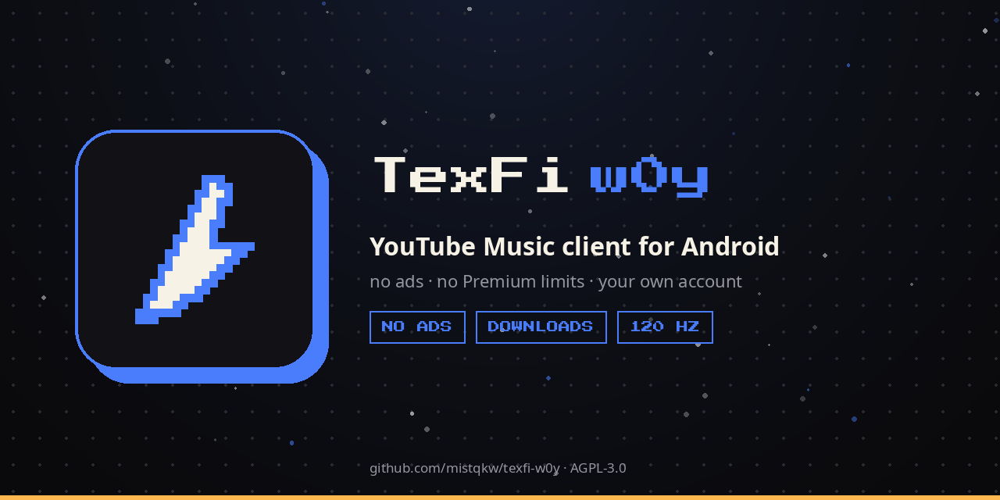

# TexFi w0y

A YouTube Music client for Android. No ads, no Premium restrictions, and
you can sign in to your own account — your library, playlists, history.

Part of the [TexFi](https://texfi-hub.vercel.app) ecosystem: pixel visual
language, dark theme by default, the same blue `#4a7dfb`.

## Why another client

Existing ones fell short on three counts, and w0y is built around exactly
those:

1. **The track starts right away.** The next track in the queue is
   prefetched, stream URLs are cached with their lifetime in mind,
   playback starts on a minimal buffer, network requests run in parallel.
   The debug build measures the time from tap to first sound and logs it —
   so optimisations are a number, not a feeling.
2. **The interface does not stutter.** Stable keys in lists, no needless
   recompositions, Baseline Profile, R8. Performance is checked on the
   release build, not on debug.
3. **There are plenty of settings.** Quality separately for Wi-Fi and
   mobile, cache and auto-download, normalisation, equaliser, queue
   behaviour, seek step, theme, colour scheme, language, settings export.
   Eleven sections with a search across all of them, and every item says
   plainly what it does.

## What already works

- **Search and playback** — tracks, albums, artists; background playback
  with a media notification, queue, repeat, shuffle.
- **Your account** — pick one of the Google accounts already on the phone
  and confirm on Google's page, or paste a cookie by hand when Google
  refuses the app's window. Playlists, likes and
  subscriptions are pulled from the account.
- **Downloads** — tracks, albums and playlists into the app's storage; each
  button shows waiting, percent and done, and a line says where to find
  them. A "Wi-Fi only" limit.
- **Your own sound, per track** — speed, pitch and reverb belong to the
  track, not to the app: SLOWED and SPED UP straight from the original
  file, remembered for that track and nothing else. The row shows the
  badge; one button puts the track back to how the rest sound.
- **Ready-made edits** — a button finds someone else's slowed or sped up
  upload of the playing track and plays it.
- **Videos in search** — clips and edits that exist only as videos, with
  wide frames, played as audio.
- **A card of the track** — the player draws a picture with the cover, the
  title and your version of it, to send wherever you like. Drawn on the
  phone; nothing is uploaded.
- **Speed dial** — what you play most, right on the home screen; a long
  press pins a track, album, playlist or artist.
- **Stats** — minutes, favourite tracks and artists for a week, a month or
  all time. Computed on the phone, and it goes nowhere.
- **Clean mode** — swaps in the official clean version when one exists;
  tracks marked "E" can be hidden or skipped. The app cannot cut words out
  of a finished recording, and will not pretend otherwise.
- **Widget** for the home screen: cover, title and transport.
- **Lyrics** from LRCLIB, synchronised line by line.
- **Four languages** — Russian, English, Ukrainian, Polish; the choice in
  settings overrides the system one.
- **Start-time measurement** — the average time from tap to first sound is
  shown on the home screen and in settings. The promise of "fast" can be
  checked.

- **Playlists on YouTube** — create a playlist here and it appears in the
  account; add or remove a track and the account follows. Nothing is
  removed from the account behind your back, and a failed write never
  undoes what you did on the phone: it is reported, with a button to
  upload the playlist again.
- **All tracks of an artist** — the same list that sits behind "Show all"
  on the artist page, fetched in full rather than the first twelve.
- **Search that answers sooner** — YouTube's own suggestions while you
  type, an "all" tab that returns tracks, albums and artists in one
  request, and matches from your own library before the network replies.
- **Audio outputs** — the outputs the system actually reports, and which
  one the music is going through.
- **A queue you can edit** — move a track up, throw it out, send one from
  search to play next or to the end. Plus a sleep timer that can wait for
  the end of the track instead of cutting it mid-word.

What's missing: a web version (and none is planned) and scrobbling.

## Building

Release APKs are built in GitHub Actions on a `v*` tag push. Locally:

```bash
./gradlew assembleDebug
```

You need JDK 21 and the Android SDK (compileSdk 37, build-tools 37). The
SDK path goes into `local.properties` (the file is in `.gitignore`).

Some tests hit the real YouTube: parsing its responses breaks when things
change on their side, and only a live request catches that. They run
locally by default; in CI they are skipped, because from a data-centre IP
YouTube answers with a refusal, and such a failure says nothing about the
code. To run them in CI on purpose — `W0Y_LIVE_TESTS=1`.

The signing key is not in the repository and never will be. Actions
secrets: `ANDROID_KEYSTORE_BASE64`, `ANDROID_STORE_PASSWORD`,
`ANDROID_KEY_PASSWORD`. See [docs/RELEASING.md](docs/RELEASING.md).

## Icon

The icon is generated from a pixel grid by code rather than stored as
images:

```bash
python3 tools/make_icons.py preview            # concept sheets into docs/
python3 tools/make_icons.py apply quill_wide   # every format into res/
python3 tools/make_banners.py                  # banners into docs/banners
```

`quill_wide` is the shape currently shipped. The banners are drawn from
the same grid, so the icon and the header cannot drift apart.

## Licences

w0y's code is [AGPL-3.0](LICENSE).

Access to YouTube Music goes through
[InnerTubeX](https://github.com/MetrolistGroup/innertubex) (GPL-3.0) —
section 13 of GPLv3 expressly permits combining a GPLv3 work with AGPLv3
into one whole. A copy of the library's licence:
[licenses/GPL-3.0-innertubex.txt](licenses/GPL-3.0-innertubex.txt).

[Metrolist](https://github.com/MetrolistGroup/Metrolist) (GPL-3.0) served
as the reference for the feature set; its code was not copied.

The Press Start 2P font — [OFL](licenses/OFL-PressStart2P.txt).

## A note on the language

The code comments are in Russian: this is a personal project and they are
written in the author's own voice. The documentation, the release notes
and the interface are in English (and in three more languages inside the
app).
