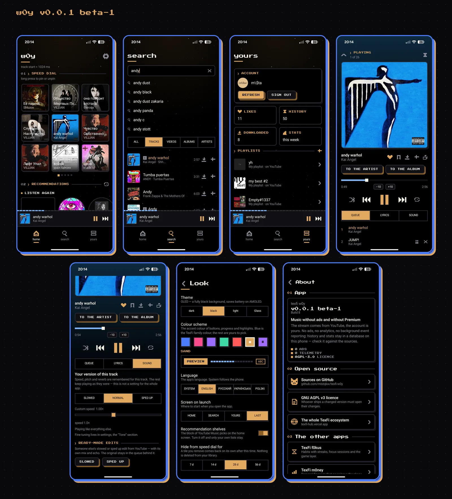

<p align="center">
  
  
  
</p>

# w0y

**Fast, adjustable, and yours.** An open client for YouTube Music: it starts
tracks quickly, has a lot of settings, shows no ads of its own and sends no
telemetry anywhere. You can sign in to your own account to get your library,
playlists and likes.

Part of the [TexFi](https://texfi-hub.vercel.app) family: pixel visual
language, dark theme by default, the same blue `#4a7cfb` and sand `#e0a860`.

## Screenshots

<!-- screenshots:start -->
[](docs/screenshots/w0y-screens.png)
<!-- screenshots:end -->

## Features

- **Search and playback** — tracks, albums, artists and videos; artist and
  album pages; background playback with a media notification, queue you can
  edit (reorder, remove, play next), repeat, shuffle, sleep timer.
- **Quick start** — the next track is prefetched, stream URLs are cached, and
  the time from tap to first sound is measured and shown, so "fast" is a
  number you can check.
- **Your account** — pick one of the Google accounts on the phone and confirm
  on Google's page, or paste a cookie by hand. Playlists, likes and
  subscriptions are synchronised both ways.
- **Lyrics** from [LRCLIB](https://lrclib.net), synchronised line by line,
  with translation.
- **Your own sound per track** — speed, pitch and reverb (SLOWED, SPED UP)
  applied to the original file and remembered for that track only.
- **Downloads** — tracks, albums, playlists; a "Wi-Fi only" limit; a button
  that copies them into `Music/w0y music`.
- **Search** with YouTube's suggestions and a history you can clear.
- **Speed dial, stats and a widget** — what you play most on the home screen,
  listening stats computed on the device, a home screen widget.
- **Clean mode** — swaps in the official clean version when one exists; tracks
  marked "E" can be hidden or skipped.
- **Settings** — eleven sections with a search across all of them: quality,
  normalisation, queue behaviour, seek step, themes and colour schemes, your
  own accent colour, settings export and import.
- **Languages** — Russian, English, Ukrainian, Polish.
- **Linux desktop version** — the same ideas on Compose Desktop; sound is
  played through `mpv`.

## Privacy

- Library, history, settings, downloads and stats are stored **on the device**
  (the Linux version: in `~/.local/share/w0y`). Nothing is uploaded to any
  server of this project; there is none, and there is no analytics or crash
  reporting.
- Requests the app makes, and why:
  - `music.youtube.com` — search, your library, stream links. If you sign in,
    the session cookie is sent there like a web browser would.
  - `accounts.google.com` — only the sign-in page.
  - `lrclib.net` — lyrics (artist, title and duration of the track).
  - `translate.googleapis.com` — only if you turn lyrics translation on; the
    lyric lines are sent for translation.
  - Public Piped servers — a fallback source of audio when YouTube does not
    give a stream link; the video id is sent.
- The sign-in cookie stays on the device. Treat it like a password.

## Install

**Android 8.0 (API 26) or newer.**

1. Download [`TexFi-w0y-android.apk`](https://github.com/texfi-w0y/texfi-w0y/releases/download/v0.0.2-beta-2/TexFi-w0y-android.apk)
   from the [release page](https://github.com/texfi-w0y/texfi-w0y/releases/tag/v0.0.2-beta-2)
   and open it. Checksums are in `SHA256SUMS.txt` next to it.
2. Or add `https://github.com/texfi-w0y/texfi-w0y` to
   [Obtainium](https://github.com/ImranR98/Obtainium).

Updates install over the top as long as they come signed with the project key.

**Linux (x86_64):** download
[`w0y-linux-x86_64.tar.gz`](https://github.com/texfi-w0y/texfi-w0y/releases/download/v0.0.2-beta-2/w0y-linux-x86_64.tar.gz),
unpack it and run `./install.sh`. You need `mpv` installed. The interface of
the Linux version is in Russian only.

## Build from source

You need JDK 21 and the Android SDK (compileSdk 37). Put the SDK path into
`local.properties` (`sdk.dir=...`, the file is git-ignored).

```bash
./gradlew testDebugUnitTest assembleDebug   # Android debug APK
```

Linux version (needs `mpv` to run):

```bash
cd desktop && ./install.sh                  # builds and installs for your user
```

Some Android tests hit the real YouTube because only a live request catches a
change in its responses. They are skipped in CI; set `W0Y_LIVE_TESTS=1` to run
them there. Release APKs are built by GitHub Actions on a `v*` tag; the
signing key is not in the repository (see [docs/RELEASING.md](docs/RELEASING.md)).

## Report a problem

Open an [issue](https://github.com/texfi-w0y/texfi-w0y/issues/new/choose) and say
what you did, what you expected and what happened. Add the app version
(Settings → About) and your Android version. The release build writes no log of its own, but the system log still shows
crashes and errors. With the phone connected and w0y running:

```bash
adb logcat -d --pid=$(adb shell pidof com.texfi.w0y) > w0y-log.txt
```

Before posting a log, remove anything personal from it.

## Licence and third-party parts

w0y is licensed under [AGPL-3.0](LICENSE).

| Component | Licence |
| --- | --- |
| [InnerTubeX](https://github.com/MetrolistGroup/innertubex), access to YouTube Music | GPL-3.0 (copy in [licenses/](licenses/GPL-3.0-innertubex.txt)); GPLv3 §13 allows combining with AGPLv3 |
| Jetpack Compose, Material 3, AndroidX (Room, DataStore, Navigation, Media3, Core) | Apache-2.0 |
| Hilt / Dagger | Apache-2.0 |
| Ktor, kotlinx.serialization, Kotlin | Apache-2.0 |
| OkHttp | Apache-2.0 |
| Coil | Apache-2.0 |
| Timber | Apache-2.0 |
| [Backdrop](https://github.com/Kyant0/AndroidLiquidGlass), liquid glass of the bottom bars | Apache-2.0 |
| [jump3r](https://github.com/Sciss/jump3r) (LAME in Java), MP3 export | LGPL-2.1 |
| Press Start 2P font | OFL ([licenses/](licenses/OFL-PressStart2P.txt)) |
| Linux version: Compose Multiplatform, dbus-java (LGPL/MIT), mpv (GPL/LGPL, run as a separate program) | see each project |

[Metrolist](https://github.com/MetrolistGroup/Metrolist) (GPL-3.0) was a
reference for the feature set; its code was not copied.

## Disclaimer

w0y is an independent project. It is not affiliated with, endorsed by or
connected to YouTube or Google. "YouTube Music" is used only to describe what
the app is compatible with. You are responsible for following the terms of
the services you use it with.

---

The code comments are in Russian: this is a personal project and they are
written in the author's own voice. The documentation and the release notes
are in English, the interface is in four languages.
